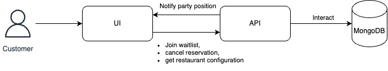

# Architecture

[TOC]

This project is divided into two parts: the API (under `/backend`) and the UI (under `/frontend`). Below you can see a high level diagram of the full project.

## Archicture decisions

To avoid going length on about each decisions, in the following section you can take a look at some decisions that seems important.

**Restaurant system**

To offer a better user experience, some configurations like the name of the restaurant, the number of seats available, the maximum number of people allowed in the group, etc. Those configurations, ended in a `RestaurantConfiguration` object, stored in the database (because, no magic values in the code!). 

Once it's in the database, why not make it a controller? Now, we have the option to support multiple restaurants. From a simple QRCode, all restaurants can offer a virtual waitlist.

For this assessment, the database is seeded with the default restaurant which is hardcoded to 10 seats like required.

**NoSQL and not SQL?**

With the restaurant system put in place, NoSQL is more than suggested. It allows storing and manipulating arrays more easily than SQL, which helps to determine the position of a party on the waitlist. Additionally, when a restaurant is deleted, the entire waitlist goes with it, making it easier to debug.

**Persistence between browser sessions**

Allowing the customer to refresh or close and then reopen the application is achieved through the LocalStorage of the browser. I didn't opt for a server session because the possibility of a customer using different browsers or devices while waiting in front of a restaurant is most unlikely. 

Thought, having an authentification for the customer would be a good option. Coupled with the restaurant system, it would allow a list of favorite restaurants, push notifications to give a review, etc.

**Server Sent Events (SSE)**

There are multiple ways to keep the UI informed of the party position in the waitlist. For example: web sockets or classic `setInterval` on the UI side, but there is another one: Server-Sent Events.

I went for those as we only need an unidirectional channel between the API and the UI. Plus, they are lighter than web sockets. So, the UI calls `/waitlist/{party_uuid}` and receives the party position in the waitlist every few seconds. 

To monitor the changes in the waitlist, I first went with the [Change Streams](https://www.mongodb.com/docs/manual/changeStreams/) of MongoDB, unfortunately, those are only available in replica sets, and they tend to not mix well with the SSE of Rails (keeping the thread running even after the client disconnected for example). Instead, I opted for a simpler solution, reading the restaurant every 2 seconds and checking if the waitlist changed. 

Keep in mind that, this is not an optimal solution, but a practical one which doesn't create concerns for this project (a single restaurant, if a maximum of 10 seats is available).

## API (backend)

**Technologies used**:

- Ruby On Rails
- MongoDB

**Important links**

- [README.md](backend/README.md)
- [OpenAPI contract](backend/docs/openapi-spec.yaml)

## UI (frontend)

**Technologies used**:

- React
- Typescript

**Important links**

- [README.md](frontend/README.md)

### User journey

## Enhancements to come

Notes: The following are ideas that I had during the development. In the following days, I will try to implement some of them in another branch, feel free to check it!

**API Security**

The communication between the UI and the API isn't secured right now. Implementing an API key would be necessary for any production deployment.

**Check-in expiration**

By following the requirements, the party that is allowed to check in is blocking the queue. In other words, if the said party never checks in, no one will check in. To avoid the deadlock, an expiration of the check-in would be a good idea, for example, after 5 minutes without checking in, the party is excluded from the queue.

**Notification**

Currently, the customer needs to stay on the application to check their position and see if the check-in is available. Which is highly inconvenient! Having a push notification service like Firebase would drastically improve the customer experience.

**Restaurant's UI**

We have a restaurant system but no restaurant interface! In the scope of this project, it doesn't make sense but in a normal restaurant, it's an employee that will indicate a table is ready, mix the walk-in customers and the reservations, etc. This interface would allow the restaurant to adjust its settings (capacity, party size, etc.) but also to update the system with the current capacity.

**Widget**

The application is a separated UI which could be unified with the restaurant's website. Offering a widget option could facilitate the restaurants' adoption.